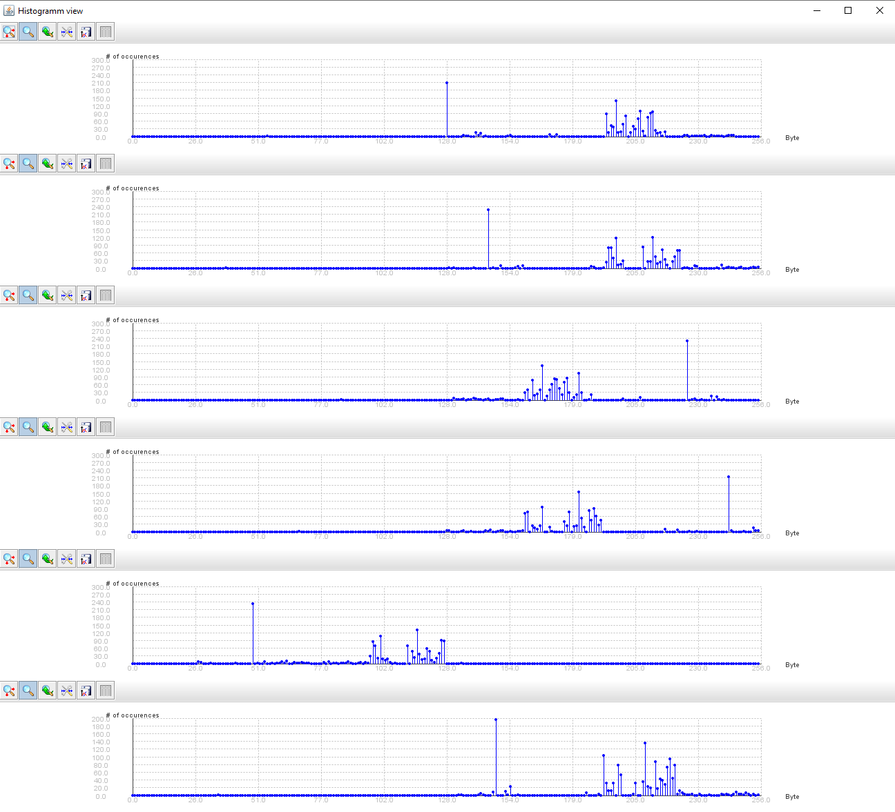
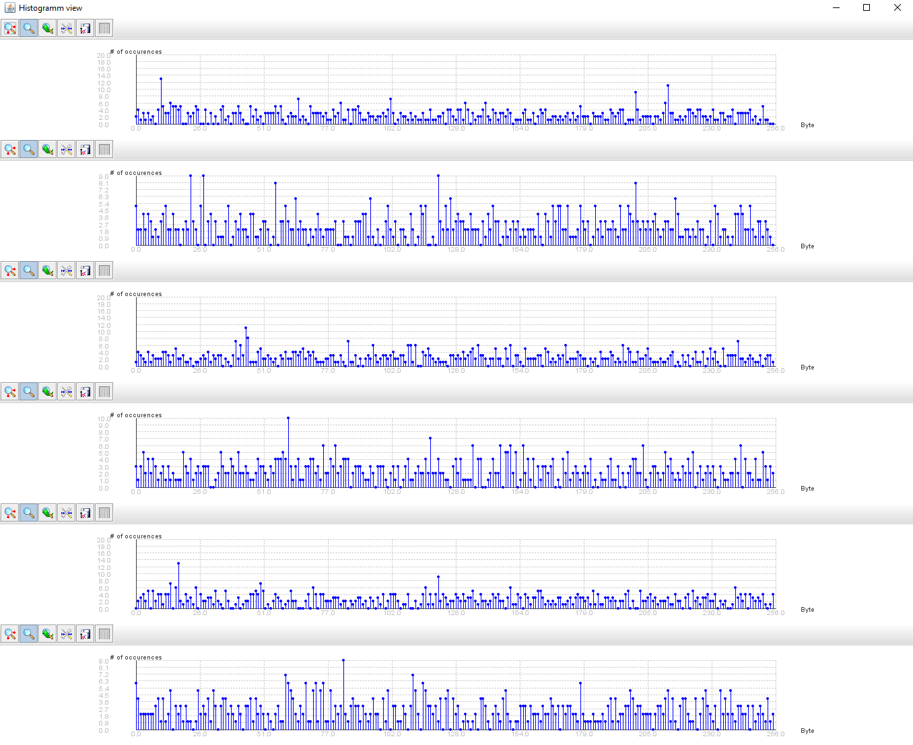

# Aufgabe 3

## 00

key[keyByte] = frequencyTable[keyByte].getMostFrequentByte();

## 01

```
java -jar XorCrackerApp.jar message01.txt.enc 4
// Output
Number of candidate keys: 1
b1 64 3 31
```

## 03

```
java -jar XorCrackerApp.jar message01.txt.enc 4
java -jar XorWithKeyApp.jar message01.txt.enc message01.txt b1 64 3 31

java -jar XorCrackerApp.jar message02.txt.enc 4
java -jar XorWithKeyApp.jar message02.txt.enc message02.txt f4 21 46 47
```

Vermutung: Weil das file in keiner latinen sprache ist und deshalb e nicht der häufigste buchstabe ist.

# Aufgabe 4

## 00

slots ist die anzahl bytes im schlüssel, ohne angabe der slots wird mit einem slot gerechnet.

## 01

Es hat für jedes Schlüsselbyte einen Wert der klar am häufigsten vorkommt. siehe 

## 02

Es gibt nur bei 2 bytes ein klar häufigstes byte. siehe 

## 03 (von hand)

Noch nicht gemacht.
